Bellabeat_Casestudy
================
Jessie Towey
2023-12-30

*The following case study was completed as my capstone project for the
Google Data Analytics Professional Certification. Thank you for
viewing.*

# **Introduction**

Bellabeat is a tech-driven wellness company dedicated to empowering
women through beautifully designed, health-focused smart products. The
company collects data on various health aspects, including activity,
sleep, stress, and reproductive health, providing women worldwide with
valuable insights into their well-being and habits.

With global offices and a diverse product range, Bellabeat has
strategically positioned itself in the market. Now, they seek to
leverage consumer data analysis to identify growth opportunities and
enhance Bellabeat’s marketing strategy for smart devices.

------------------------------------------------------------------------

# **Ask**

*Identifying Key Stakeholders:*

- Urška Sršen: Bellabeat’s cofounder and Chief Creative Officer
- Sando Mur: Bellabeat’s cofounder, mathematician, and key member of
  executive team
- Bellabeat’s marketing analytics team

*Questions from Stakeholders:*

- What are some trends in smart device usage?
- How could these trends apply to Bellabeat customers?
- How could these trends help influence Bellabeat marketing strategy?

**Defining Business Task:**

Analyze FitBit Fitness Tracker Data to gain insights into how consumer
are using the app and exploring growth opportunities for the Bellabeat
marketing strategy.

------------------------------------------------------------------------

# **Prepare**

*What Data?*

Fortunately, Urška Sršen provided a data set for exploration:

- [Kaggle FitBit Fitness Tracker
  Data](https://www.kaggle.com/datasets/arashnic/fitbit) and importing
  them into R Studio, it is time to begin processing the data!

  *This data set, collected from 30 eligible Fitbit users through an
  Amazon Mechanical Turk survey from 03.12.2016 to 05.12.2016, includes
  minute-level and daily level data on physical activity, heart rate,
  and sleep. Users provided personal tracker data, and individual
  reports can be sorted by export session ID (column A) or timestamp
  (column B), reflecting variations in Fitbit tracker types and
  individual tracking behaviors.*

After downloading the data set from Kaggle, it is time to prepare for,
store, and organize it! First, we need to install R Packages to assist
our analysis.

### Installing Packages

Below are the necessary packages for exploring this data analysis:

- ‘here’ provides a consistent way of referring to files and directories
  in your project.

- ‘skimr’ generates summary statistics and beautiful visualizations for
  data exploration.

- ‘janitor’ offers convenient functions for cleaning and analyzing data.

- ‘dplyr’ is a powerful package for data manipulation and
  transformation.

- ‘tidyverse’ is a collection of R packages, including ‘dplyr’, for data
  science and visualization.

- ‘lubridate’ simplifies the handling of dates and times in R.

<!-- -->

    ## 
    ## The downloaded binary packages are in
    ##  /var/folders/xq/1sm36fgn3651btrmwdj3c5hw0000gn/T//RtmpmOkSDJ/downloaded_packages

    ## 
    ## The downloaded binary packages are in
    ##  /var/folders/xq/1sm36fgn3651btrmwdj3c5hw0000gn/T//RtmpmOkSDJ/downloaded_packages

    ## 
    ## The downloaded binary packages are in
    ##  /var/folders/xq/1sm36fgn3651btrmwdj3c5hw0000gn/T//RtmpmOkSDJ/downloaded_packages

    ## 
    ## The downloaded binary packages are in
    ##  /var/folders/xq/1sm36fgn3651btrmwdj3c5hw0000gn/T//RtmpmOkSDJ/downloaded_packages

    ## 
    ## The downloaded binary packages are in
    ##  /var/folders/xq/1sm36fgn3651btrmwdj3c5hw0000gn/T//RtmpmOkSDJ/downloaded_packages

### Loading Packages

Now it is time to load the packages we installed so that we can use
their features and functions!

    ## here() starts at /Users/home/Desktop/jessiesCode/BellabeatCasestudy

    ## 
    ## Attaching package: 'janitor'

    ## The following objects are masked from 'package:stats':
    ## 
    ##     chisq.test, fisher.test

    ## 
    ## Attaching package: 'dplyr'

    ## The following objects are masked from 'package:stats':
    ## 
    ##     filter, lag

    ## The following objects are masked from 'package:base':
    ## 
    ##     intersect, setdiff, setequal, union

    ## ── Attaching core tidyverse packages ────────────── tidyverse 2.0.0 ──
    ## ✔ forcats   1.0.0     ✔ readr     2.1.4
    ## ✔ ggplot2   3.4.4     ✔ stringr   1.5.1
    ## ✔ lubridate 1.9.3     ✔ tibble    3.2.1
    ## ✔ purrr     1.0.2     ✔ tidyr     1.3.0
    ## ── Conflicts ──────────────────────────────── tidyverse_conflicts() ──
    ## ✖ dplyr::filter() masks stats::filter()
    ## ✖ dplyr::lag()    masks stats::lag()
    ## ℹ Use the conflicted package (<http://conflicted.r-lib.org/>) to force all conflicts to become errors

### Creating Dataframes

Now that we’ve completed our preparations for data analysis, it’s time
to import our data sets. These data sets are currently in CSV
(Comma-Separated Value) format and need to be converted into data frames
for further processing.

    ## Rows: 940 Columns: 15
    ## ── Column specification ──────────────────────────────────────────────
    ## Delimiter: ","
    ## chr  (1): ActivityDate
    ## dbl (14): Id, TotalSteps, TotalDistance, TrackerDistance, LoggedAc...
    ## 
    ## ℹ Use `spec()` to retrieve the full column specification for this data.
    ## ℹ Specify the column types or set `show_col_types = FALSE` to quiet this message.
    ## Rows: 940 Columns: 3
    ## ── Column specification ──────────────────────────────────────────────
    ## Delimiter: ","
    ## chr (1): ActivityDay
    ## dbl (2): Id, Calories
    ## 
    ## ℹ Use `spec()` to retrieve the full column specification for this data.
    ## ℹ Specify the column types or set `show_col_types = FALSE` to quiet this message.
    ## Rows: 940 Columns: 10
    ## ── Column specification ──────────────────────────────────────────────
    ## Delimiter: ","
    ## chr (1): ActivityDay
    ## dbl (9): Id, SedentaryMinutes, LightlyActiveMinutes, FairlyActiveM...
    ## 
    ## ℹ Use `spec()` to retrieve the full column specification for this data.
    ## ℹ Specify the column types or set `show_col_types = FALSE` to quiet this message.

### Absorbing the Data

Now that our data sets are in data frame format, we can start exploring
their object types, naming conventions, and structure.

``` r
str(dailyActivity_df)
```

    ## spc_tbl_ [940 × 15] (S3: spec_tbl_df/tbl_df/tbl/data.frame)
    ##  $ Id                      : num [1:940] 1.5e+09 1.5e+09 1.5e+09 1.5e+09 1.5e+09 ...
    ##  $ ActivityDate            : chr [1:940] "4/12/2016" "4/13/2016" "4/14/2016" "4/15/2016" ...
    ##  $ TotalSteps              : num [1:940] 13162 10735 10460 9762 12669 ...
    ##  $ TotalDistance           : num [1:940] 8.5 6.97 6.74 6.28 8.16 ...
    ##  $ TrackerDistance         : num [1:940] 8.5 6.97 6.74 6.28 8.16 ...
    ##  $ LoggedActivitiesDistance: num [1:940] 0 0 0 0 0 0 0 0 0 0 ...
    ##  $ VeryActiveDistance      : num [1:940] 1.88 1.57 2.44 2.14 2.71 ...
    ##  $ ModeratelyActiveDistance: num [1:940] 0.55 0.69 0.4 1.26 0.41 ...
    ##  $ LightActiveDistance     : num [1:940] 6.06 4.71 3.91 2.83 5.04 ...
    ##  $ SedentaryActiveDistance : num [1:940] 0 0 0 0 0 0 0 0 0 0 ...
    ##  $ VeryActiveMinutes       : num [1:940] 25 21 30 29 36 38 42 50 28 19 ...
    ##  $ FairlyActiveMinutes     : num [1:940] 13 19 11 34 10 20 16 31 12 8 ...
    ##  $ LightlyActiveMinutes    : num [1:940] 328 217 181 209 221 164 233 264 205 211 ...
    ##  $ SedentaryMinutes        : num [1:940] 728 776 1218 726 773 ...
    ##  $ Calories                : num [1:940] 1985 1797 1776 1745 1863 ...
    ##  - attr(*, "spec")=
    ##   .. cols(
    ##   ..   Id = col_double(),
    ##   ..   ActivityDate = col_character(),
    ##   ..   TotalSteps = col_double(),
    ##   ..   TotalDistance = col_double(),
    ##   ..   TrackerDistance = col_double(),
    ##   ..   LoggedActivitiesDistance = col_double(),
    ##   ..   VeryActiveDistance = col_double(),
    ##   ..   ModeratelyActiveDistance = col_double(),
    ##   ..   LightActiveDistance = col_double(),
    ##   ..   SedentaryActiveDistance = col_double(),
    ##   ..   VeryActiveMinutes = col_double(),
    ##   ..   FairlyActiveMinutes = col_double(),
    ##   ..   LightlyActiveMinutes = col_double(),
    ##   ..   SedentaryMinutes = col_double(),
    ##   ..   Calories = col_double()
    ##   .. )
    ##  - attr(*, "problems")=<externalptr>

``` r
str(dailyCalories_df)
```

    ## spc_tbl_ [940 × 3] (S3: spec_tbl_df/tbl_df/tbl/data.frame)
    ##  $ Id         : num [1:940] 1.5e+09 1.5e+09 1.5e+09 1.5e+09 1.5e+09 ...
    ##  $ ActivityDay: chr [1:940] "4/12/2016" "4/13/2016" "4/14/2016" "4/15/2016" ...
    ##  $ Calories   : num [1:940] 1985 1797 1776 1745 1863 ...
    ##  - attr(*, "spec")=
    ##   .. cols(
    ##   ..   Id = col_double(),
    ##   ..   ActivityDay = col_character(),
    ##   ..   Calories = col_double()
    ##   .. )
    ##  - attr(*, "problems")=<externalptr>

``` r
str(dailyIntensities_df)
```

    ## spc_tbl_ [940 × 10] (S3: spec_tbl_df/tbl_df/tbl/data.frame)
    ##  $ Id                      : num [1:940] 1.5e+09 1.5e+09 1.5e+09 1.5e+09 1.5e+09 ...
    ##  $ ActivityDay             : chr [1:940] "4/12/2016" "4/13/2016" "4/14/2016" "4/15/2016" ...
    ##  $ SedentaryMinutes        : num [1:940] 728 776 1218 726 773 ...
    ##  $ LightlyActiveMinutes    : num [1:940] 328 217 181 209 221 164 233 264 205 211 ...
    ##  $ FairlyActiveMinutes     : num [1:940] 13 19 11 34 10 20 16 31 12 8 ...
    ##  $ VeryActiveMinutes       : num [1:940] 25 21 30 29 36 38 42 50 28 19 ...
    ##  $ SedentaryActiveDistance : num [1:940] 0 0 0 0 0 0 0 0 0 0 ...
    ##  $ LightActiveDistance     : num [1:940] 6.06 4.71 3.91 2.83 5.04 ...
    ##  $ ModeratelyActiveDistance: num [1:940] 0.55 0.69 0.4 1.26 0.41 ...
    ##  $ VeryActiveDistance      : num [1:940] 1.88 1.57 2.44 2.14 2.71 ...
    ##  - attr(*, "spec")=
    ##   .. cols(
    ##   ..   Id = col_double(),
    ##   ..   ActivityDay = col_character(),
    ##   ..   SedentaryMinutes = col_double(),
    ##   ..   LightlyActiveMinutes = col_double(),
    ##   ..   FairlyActiveMinutes = col_double(),
    ##   ..   VeryActiveMinutes = col_double(),
    ##   ..   SedentaryActiveDistance = col_double(),
    ##   ..   LightActiveDistance = col_double(),
    ##   ..   ModeratelyActiveDistance = col_double(),
    ##   ..   VeryActiveDistance = col_double()
    ##   .. )
    ##  - attr(*, "problems")=<externalptr>

``` r
str(sleepDay_df)
```

    ## 'data.frame':    413 obs. of  5 variables:
    ##  $ Id                : num  1.5e+09 1.5e+09 1.5e+09 1.5e+09 1.5e+09 ...
    ##  $ SleepDay          : chr  "4/12/2016 12:00:00 AM" "4/13/2016 12:00:00 AM" "4/15/2016 12:00:00 AM" "4/16/2016 12:00:00 AM" ...
    ##  $ TotalSleepRecords : int  1 2 1 2 1 1 1 1 1 1 ...
    ##  $ TotalMinutesAsleep: int  327 384 412 340 700 304 360 325 361 430 ...
    ##  $ TotalTimeInBed    : int  346 407 442 367 712 320 377 364 384 449 ...

``` r
str(dailySteps_df)
```

    ## 'data.frame':    940 obs. of  3 variables:
    ##  $ Id         : num  1.5e+09 1.5e+09 1.5e+09 1.5e+09 1.5e+09 ...
    ##  $ ActivityDay: chr  "4/12/2016" "4/13/2016" "4/14/2016" "4/15/2016" ...
    ##  $ StepTotal  : int  13162 10735 10460 9762 12669 9705 13019 15506 10544 9819 ...

``` r
str(heartrateSeconds_df)
```

    ## 'data.frame':    2483658 obs. of  3 variables:
    ##  $ Id   : num  2.02e+09 2.02e+09 2.02e+09 2.02e+09 2.02e+09 ...
    ##  $ Time : chr  "4/12/2016 7:21:00 AM" "4/12/2016 7:21:05 AM" "4/12/2016 7:21:10 AM" "4/12/2016 7:21:20 AM" ...
    ##  $ Value: int  97 102 105 103 101 95 91 93 94 93 ...

``` r
str(weightLogInfo_df)
```

    ## 'data.frame':    67 obs. of  8 variables:
    ##  $ Id            : num  1.50e+09 1.50e+09 1.93e+09 2.87e+09 2.87e+09 ...
    ##  $ Date          : chr  "5/2/2016 11:59:59 PM" "5/3/2016 11:59:59 PM" "4/13/2016 1:08:52 AM" "4/21/2016 11:59:59 PM" ...
    ##  $ WeightKg      : num  52.6 52.6 133.5 56.7 57.3 ...
    ##  $ WeightPounds  : num  116 116 294 125 126 ...
    ##  $ Fat           : int  22 NA NA NA NA 25 NA NA NA NA ...
    ##  $ BMI           : num  22.6 22.6 47.5 21.5 21.7 ...
    ##  $ IsManualReport: chr  "True" "True" "False" "True" ...
    ##  $ LogId         : num  1.46e+12 1.46e+12 1.46e+12 1.46e+12 1.46e+12 ...

### Cleaning/Transforming the Data

*Naming*:

Upon closer examination of the data sets, we identified opportunities
for consistency improvement. Initially, we’ll rename sleepDay_df to
dailySleep_df to align with other daily dataframe conventions.
Additionally, for uniformity, we’ll standardize the naming of date or
time variables in all dataframes to “Date.”

*Data Types*:

Using the Structure Function earlier, we also observed that the date
variables are currently stored as “chr” (character) data types. To
enhance accuracy, it is crucial to convert these date variables to the
“date” data type.

``` r
dailyActivity_df$Date <- as.Date(dailyActivity_df$Date, format="%m/%d/%Y")
dailyCalories_df$Date <- as.Date(dailyCalories_df$Date, format="%m/%d/%Y")
dailyIntensities_df$Date <- as.Date(dailyIntensities_df$Date, format="%m/%d/%Y")
dailySleep_df$Date <- as.Date(dailySleep_df$Date, format="%m/%d/%Y")
dailySteps_df$Date <- as.Date(dailySteps_df$Date, format="%m/%d/%Y")
heartrateSeconds_df$Date <- as.Date(heartrateSeconds_df$Date, format="%m/%d/%Y")
weightLogInfo_df$Date <- as.Date(weightLogInfo_df$Date, Date="%m/%d/%Y")
```

*Cleaning*:

1.  Check for null or missing values

``` r
any(is.na(dailyActivity_df))
```

    ## [1] FALSE

``` r
any(is.na(dailyCalories_df))
```

    ## [1] FALSE

``` r
any(is.na(dailyIntensities_df))
```

    ## [1] FALSE

``` r
any(is.na(dailySleep_df))
```

    ## [1] FALSE

``` r
any(is.na(dailySteps_df))
```

    ## [1] FALSE

``` r
any(is.na(heartrateSeconds_df))
```

    ## [1] FALSE

``` r
any(is.na(weightLogInfo_df))
```

    ## [1] TRUE

*It is important to note that the WeightLogInfo_df returned a “TRUE” for
null or missing values. Upon inspection, the variable measuring total
‘Fat’ lost has many null values. It is likely not a strong metric to use
as we continue to analyse further.*

2.  Remove duplicates for each data frame

``` r
dailyActivity_df <- distinct(dailyActivity_df)
dailyCalories_df <- distinct(dailyCalories_df)
dailyIntensities_df <- distinct(dailyIntensities_df)
dailySleep_df <- distinct(dailySleep_df)
dailySteps_df <- distinct(dailySteps_df)
heartrateSeconds_df <- distinct(heartrateSeconds_df)
weightLogInfo_df <- distinct(weightLogInfo_df)
```

### Merging Data

Now that our data is clean and organized, we are ready to perform merges
for future analysis. We may need to merge more data when we get further
into analysis, but there are a few merges we can make right away!

Firstly, let’s merge the dailyActivity_df with dailySleep_df.

Subsequently, we’ll merge dailySleep_df with heartrateSeconds_df. To
facilitate this, we need to transform heartrateSeconds_df into a
dataframe that represents the average heartrate per user per day.

``` r
# Merge dailySleep_df and dailyActivity_df
activity_sleep <- merge(dailySleep_df, dailyActivity_df, by=c('Id', 'Date'))
head(activity_sleep)
```

    ##           Id       Date TotalSleepRecords TotalMinutesAsleep
    ## 1 1503960366 2016-04-12                 1                327
    ## 2 1503960366 2016-04-13                 2                384
    ## 3 1503960366 2016-04-15                 1                412
    ## 4 1503960366 2016-04-16                 2                340
    ## 5 1503960366 2016-04-17                 1                700
    ## 6 1503960366 2016-04-19                 1                304
    ##   TotalTimeInBed TotalSteps TotalDistance TrackerDistance
    ## 1            346      13162          8.50            8.50
    ## 2            407      10735          6.97            6.97
    ## 3            442       9762          6.28            6.28
    ## 4            367      12669          8.16            8.16
    ## 5            712       9705          6.48            6.48
    ## 6            320      15506          9.88            9.88
    ##   LoggedActivitiesDistance VeryActiveDistance
    ## 1                        0               1.88
    ## 2                        0               1.57
    ## 3                        0               2.14
    ## 4                        0               2.71
    ## 5                        0               3.19
    ## 6                        0               3.53
    ##   ModeratelyActiveDistance LightActiveDistance
    ## 1                     0.55                6.06
    ## 2                     0.69                4.71
    ## 3                     1.26                2.83
    ## 4                     0.41                5.04
    ## 5                     0.78                2.51
    ## 6                     1.32                5.03
    ##   SedentaryActiveDistance VeryActiveMinutes FairlyActiveMinutes
    ## 1                       0                25                  13
    ## 2                       0                21                  19
    ## 3                       0                29                  34
    ## 4                       0                36                  10
    ## 5                       0                38                  20
    ## 6                       0                50                  31
    ##   LightlyActiveMinutes SedentaryMinutes Calories
    ## 1                  328              728     1985
    ## 2                  217              776     1797
    ## 3                  209              726     1745
    ## 4                  221              773     1863
    ## 5                  164              539     1728
    ## 6                  264              775     2035

``` r
# Transforming heartrateSeconds_df into a daily heart rate per user data frame
dailyHeartrate_df <- heartrateSeconds_df %>%
  group_by(Id, Date) %>%
  
  summarise(AverageHeartrate = mean(Value, na.rm = TRUE))
```

    ## `summarise()` has grouped output by 'Id'. You can override using the
    ## `.groups` argument.

``` r
head(dailyHeartrate_df)
```

    ## # A tibble: 6 × 3
    ## # Groups:   Id [1]
    ##           Id Date       AverageHeartrate
    ##        <dbl> <date>                <dbl>
    ## 1 2022484408 2016-04-12             92.6
    ## 2 2022484408 2016-04-13            103. 
    ## 3 2022484408 2016-04-14             85.7
    ## 4 2022484408 2016-04-15            114. 
    ## 5 2022484408 2016-04-16             91.3
    ## 6 2022484408 2016-04-17            104.

``` r
# Now we can combine our daily sleep data with our daily heart rate data! 
heartrate_sleep <- merge(dailyHeartrate_df, dailySleep_df, by = "Id", all = TRUE)
head(heartrate_sleep)
```

    ##           Id Date.x AverageHeartrate     Date.y TotalSleepRecords
    ## 1 1503960366   <NA>               NA 2016-04-12                 1
    ## 2 1503960366   <NA>               NA 2016-04-13                 2
    ## 3 1503960366   <NA>               NA 2016-04-15                 1
    ## 4 1503960366   <NA>               NA 2016-04-16                 2
    ## 5 1503960366   <NA>               NA 2016-04-17                 1
    ## 6 1503960366   <NA>               NA 2016-04-19                 1
    ##   TotalMinutesAsleep TotalTimeInBed
    ## 1                327            346
    ## 2                384            407
    ## 3                412            442
    ## 4                340            367
    ## 5                700            712
    ## 6                304            320

------------------------------------------------------------------------

# **Analyze**

With a few of our data sets fully merged, we can start to explore the
data and analyze more visually.

Let’s get to exploring!

## Sample Sizes

*Let’s get to know our sample sizes by breaking down by the number of
unique users, the number of entries per health aspect, and the average
duration users spent tracking their health.*

``` r
  # Vector for User Count
dailyCounts <- c(
  n_distinct(dailyActivity_df$Id),
  n_distinct(dailyCalories_df$Id),
  n_distinct(dailyIntensities_df$Id),
  n_distinct(dailySleep_df$Id),
  n_distinct(dailySteps_df$Id),
  n_distinct(heartrateSeconds_df$Id),
  n_distinct(weightLogInfo_df$Id))
# Names for the bars
daily_bars <- c("Activity", "Calories", "Intensities", "Sleep", "Steps", "Heart", "Weight")
# Create a data frame with the counts and labels
df <- data.frame(DataFrame = daily_bars, Count = dailyCounts)
# Create the bar chart
ggplot(df, aes(x = DataFrame, y = Count, fill = DataFrame)) +
  geom_bar(stat = "identity", color = "white", size = 6) +
  geom_text(aes(label = Count), position = position_stack(vjust = 0.5), size = 6, color = "white") +
  labs(title = "Distinct User ID by Health Aspect", x = "DataFrame", y = "Count") +
  theme_minimal()
```

    ## Warning: Using `size` aesthetic for lines was deprecated in ggplot2 3.4.0.
    ## ℹ Please use `linewidth` instead.
    ## This warning is displayed once every 8 hours.
    ## Call `lifecycle::last_lifecycle_warnings()` to see where this warning
    ## was generated.

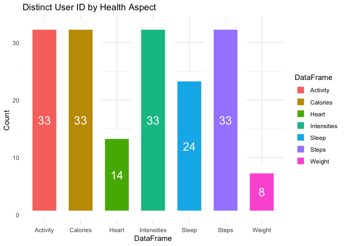<!-- -->

<span style="color: red;">*It is important to highlight that the Heart
and Weight data suffer from limited unique user representation,
significantly compromising reliability due to the small sample
size.*</span>

Despite the limited number of users in the Heart and Weight data sets,
it’s worth exploring the frequency of user engagement with the product
within the given time frame.

To facilitate this analysis, we can devise a function called
calculate_duration. This function, when applied to various health aspect
data frames, computes the total number of entries and the duration of
user engagement. By doing so, we can generate comprehensive insights
into user participation across different health aspects.

``` r
# Create a function to calculate the duration and number of entries of recording for each user
calculate_duration <- function(data) {
  data %>%
    group_by(Id) %>%
    summarise(
      entries = n(),
      duration = as.numeric(difftime(max(Date), min(Date), units = "days"))
    )
}
# Apply that function to each data frame
user_summary_activity <- calculate_duration(dailyActivity_df)
user_summary_calories <- calculate_duration(dailyCalories_df)
user_summary_intensities <- calculate_duration(dailyIntensities_df)
user_summary_sleep <- calculate_duration(dailySleep_df)
user_summary_steps <- calculate_duration(dailySteps_df)
user_summary_heartrate <- calculate_duration(dailyHeartrate_df)
user_summary_weight <- calculate_duration(weightLogInfo_df)

# Combine the results into a single data frame
user_summary <- bind_rows(
  mutate(user_summary_activity, Data = "dailyActivity_df"),
  mutate(user_summary_calories, Data = "dailyCalories_df"),
  mutate(user_summary_intensities, Data = "dailyIntensities_df"),
  mutate(user_summary_sleep, Data = "dailySleep_df"),
  mutate(user_summary_steps, Data = "dailySteps_df"),
  mutate(user_summary_heartrate, Data = "dailyHeartrate_df"),
  mutate(user_summary_weight, Data = "weightLogInfo_df")
)
head(user_summary)
```

    ## # A tibble: 6 × 4
    ##           Id entries duration Data            
    ##        <dbl>   <int>    <dbl> <chr>           
    ## 1 1503960366      31       30 dailyActivity_df
    ## 2 1624580081      31       30 dailyActivity_df
    ## 3 1644430081      30       29 dailyActivity_df
    ## 4 1844505072      31       30 dailyActivity_df
    ## 5 1927972279      31       30 dailyActivity_df
    ## 6 2022484408      31       30 dailyActivity_df

Let’s refine our analysis to explore the average number of entries per
day per user across different data sets. This will provide insights into
the frequency of user engagement with the product over time.

``` r
user_dailyAvgEntries <- user_summary %>%
  group_by(Id) %>%
  summarise(average_entries = mean(entries))
print(user_dailyAvgEntries)
```

    ## # A tibble: 33 × 2
    ##            Id average_entries
    ##         <dbl>           <dbl>
    ##  1 1503960366            25.2
    ##  2 1624580081            31  
    ##  3 1644430081            24.8
    ##  4 1844505072            25.4
    ##  5 1927972279            21.7
    ##  6 2022484408            31  
    ##  7 2026352035            26  
    ##  8 2320127002            25  
    ##  9 2347167796            17.5
    ## 10 2873212765            25.2
    ## # ℹ 23 more rows

Now we can delve into the data to examine the distribution of entries
across the various health aspects. This analysis will shed light on the
user preferences and indicate whether certain aspects garnered more
attention and engagement compared to others.

``` r
# Aggregate data by Data type
data_aggregated <- user_summary %>%
  group_by(Data) %>%
  summarise(entries = sum(entries))

# Bar plot for aggregated counts by Data type
ggplot(data_aggregated, aes(x = Data, y = entries, fill = Data)) +
  geom_bar(stat = "identity") +
  geom_text(aes(label = entries), position = position_stack(vjust = 0.5), size = 6, color = "white") +
  labs(title = "Total Number of Entries by Health Aspect",
       x = "Data Type", y = "Total Entries") +
  theme_minimal() +
  theme(axis.text.x = element_text(angle = 45, hjust = 1))
```

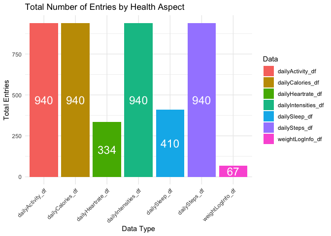<!-- -->

*This graph highlights the correlation between the number of unique
users, and their total number of entries per health aspect. These graphs
are fairly similar in shape regardless of their scale, however, further
analysis would be needed to understand how often each user contributed
on a more granular level.*

Now, let’s extend our analysis to calculate the average duration, in
days, that users spent engaging with the product. This will offer
insights into the overall time commitment and user persistence over the
study period.

``` r
# Aggregate data by Data type
data_aggregated <- user_summary %>%
  drop_na() %>%
  group_by(Data) %>%
  summarise(duration = mean(duration))

# Bar plot for aggregated counts by Data type
ggplot(data_aggregated, aes(x = Data, y = duration, fill = Data)) +
  geom_bar(stat = "identity") +
    geom_text(aes(label = round(duration,2)), position = position_stack(vjust = 0.5), size = 3, color = "white") +
  labs(title = "Average Days Used by Data Type",
       x = "Data Type", y = "# of Days") +
  theme_minimal() +
  theme(axis.text.x = element_text(angle = 45, hjust = 1))
```

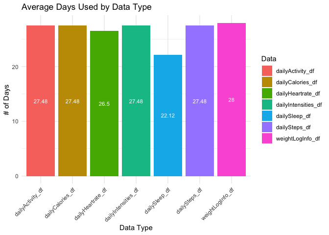<!-- -->

*Despite the limited total unique user IDs and entries for Heart, Sleep,
and Weight data, we observe a relatively even distribution in terms of
the average duration each user engaged with the different health
aspects. This suggests a consistent duration pattern across different
data types over the available time frame.*

Now that we know more about our sample sizes, let’s summarize the key
touch points within our selected data sets using the Summary Function.
This will help us determine what to look for next.

## Summary

``` r
# activity
dailyActivity_df %>%  
  select(TotalSteps,
         TotalDistance,
         Calories,SedentaryMinutes, FairlyActiveMinutes, LightlyActiveMinutes, VeryActiveMinutes) %>%
  summary()
```

    ##    TotalSteps    TotalDistance       Calories    SedentaryMinutes
    ##  Min.   :    0   Min.   : 0.000   Min.   :   0   Min.   :   0.0  
    ##  1st Qu.: 3790   1st Qu.: 2.620   1st Qu.:1828   1st Qu.: 729.8  
    ##  Median : 7406   Median : 5.245   Median :2134   Median :1057.5  
    ##  Mean   : 7638   Mean   : 5.490   Mean   :2304   Mean   : 991.2  
    ##  3rd Qu.:10727   3rd Qu.: 7.713   3rd Qu.:2793   3rd Qu.:1229.5  
    ##  Max.   :36019   Max.   :28.030   Max.   :4900   Max.   :1440.0  
    ##  FairlyActiveMinutes LightlyActiveMinutes VeryActiveMinutes
    ##  Min.   :  0.00      Min.   :  0.0        Min.   :  0.00   
    ##  1st Qu.:  0.00      1st Qu.:127.0        1st Qu.:  0.00   
    ##  Median :  6.00      Median :199.0        Median :  4.00   
    ##  Mean   : 13.56      Mean   :192.8        Mean   : 21.16   
    ##  3rd Qu.: 19.00      3rd Qu.:264.0        3rd Qu.: 32.00   
    ##  Max.   :143.00      Max.   :518.0        Max.   :210.00

``` r
# hourly calories
dailyCalories_df %>%
  select(Calories) %>%
  summary()
```

    ##     Calories   
    ##  Min.   :   0  
    ##  1st Qu.:1828  
    ##  Median :2134  
    ##  Mean   :2304  
    ##  3rd Qu.:2793  
    ##  Max.   :4900

``` r
# intensities
dailyIntensities_df %>%
  select(LightActiveDistance, VeryActiveDistance) %>%
  summary()
```

    ##  LightActiveDistance VeryActiveDistance
    ##  Min.   : 0.000      Min.   : 0.000    
    ##  1st Qu.: 1.945      1st Qu.: 0.000    
    ##  Median : 3.365      Median : 0.210    
    ##  Mean   : 3.341      Mean   : 1.503    
    ##  3rd Qu.: 4.782      3rd Qu.: 2.053    
    ##  Max.   :10.710      Max.   :21.920

``` r
# sleep
dailySleep_df %>%
  select(TotalSleepRecords, TotalMinutesAsleep, TotalTimeInBed) %>%
  summary()
```

    ##  TotalSleepRecords TotalMinutesAsleep TotalTimeInBed 
    ##  Min.   :1.00      Min.   : 58.0      Min.   : 61.0  
    ##  1st Qu.:1.00      1st Qu.:361.0      1st Qu.:403.8  
    ##  Median :1.00      Median :432.5      Median :463.0  
    ##  Mean   :1.12      Mean   :419.2      Mean   :458.5  
    ##  3rd Qu.:1.00      3rd Qu.:490.0      3rd Qu.:526.0  
    ##  Max.   :3.00      Max.   :796.0      Max.   :961.0

``` r
# heart rate
heartrateSeconds_df %>%
  select(Value) %>%
  summary() 
```

    ##      Value       
    ##  Min.   : 36.00  
    ##  1st Qu.: 73.00  
    ##  Median : 94.00  
    ##  Mean   : 96.59  
    ##  3rd Qu.:117.00  
    ##  Max.   :203.00

``` r
# weight
weightLogInfo_df %>%
  select(WeightKg, BMI) %>%
  summary()
```

    ##     WeightKg           BMI       
    ##  Min.   : 52.60   Min.   :21.45  
    ##  1st Qu.: 61.40   1st Qu.:23.96  
    ##  Median : 62.50   Median :24.39  
    ##  Mean   : 72.04   Mean   :25.19  
    ##  3rd Qu.: 85.05   3rd Qu.:25.56  
    ##  Max.   :133.50   Max.   :47.54

``` r
# user info
user_summary %>%
  select(entries, duration) %>%
  summary()
```

    ##     entries         duration    
    ##  Min.   : 1.00   Min.   : 0.00  
    ##  1st Qu.:25.25   1st Qu.:27.00  
    ##  Median :31.00   Median :30.00  
    ##  Mean   :25.68   Mean   :26.65  
    ##  3rd Qu.:31.00   3rd Qu.:30.00  
    ##  Max.   :31.00   Max.   :30.00  
    ##                  NA's   :7

### Key Observations from Summary

- Physical Activity:

Total Steps: The data shows a wide range in total steps, suggesting a
diverse user base with varying activity levels. This could inform
targeted fitness plans or challenges to engage users.

Total Distance: Users cover a broad distance, indicating different
preferences in physical activities. Bellabeat might tailor product
features or recommendations based on these preferences.

Calories: The distribution of calories burned highlights variations in
users’ metabolism and activity intensity. This could be leveraged for
personalized fitness guidance or nutritional insights.

Very Active Minutes: The considerable range in very active minutes
implies a spectrum of fitness dedication among users. Bellabeat could
develop features catering to both beginners and fitness enthusiasts.

- Sleep:

Total Sleep Records: The majority of users have one sleep record,
suggesting a consistent sleep tracking pattern. Bellabeat could enhance
features related to sleep quality or introduce personalized sleep
insights.

Total Minutes Asleep: The diverse range in minutes asleep indicates
different sleep durations among users. Bellabeat might offer tailored
sleep recommendations or content based on individual needs.

Total Time in Bed: Variability in time spent in bed could be due to
lifestyle differences. Bellabeat may provide insights into optimizing
sleep routines or adjusting sleep patterns for improved well-being.

- Weight and BMI:

Weight (Kg): The distribution in weight showcases diversity among users.
Bellabeat might offer personalized weight management plans or
collaborate with health professionals for tailored advice.

BMI: The range in BMI values suggests a mix of body compositions among
users. Bellabeat could develop features promoting holistic well-being,
considering diverse health goals and body types.

\*Data Entries and Duration:

Entries: The consistent number of entries per day could indicate user
engagement. Bellabeat may further encourage regular participation or
offer incentives to maintain user interest.

Duration: The uniform duration of 30 minutes per day suggests a
standardized data collection time frame. But is that enough time to
understand health? Bellabeat might consider providing options for
flexible data collection periods to accommodate diverse user
preferences.

*Overall, it is clear that our users have a wide range of different
health habits. Now let’s explore if there were any changes to our users
health aspects over time!*

**Key Questions to Explore**

- *Exploring Health and Weight: Given the significance of the weight
  loss industry, what correlations exist between various health aspects
  and metrics such as calories burned, BMI changes, and weight changes?*

- *Sleep and Health Correlations: Are there discernible correlations
  between sleep patterns and different health aspects, shedding light on
  the impact of sleep on overall well-being?*

- *Product Usage and Health Impacts: Do patterns of product usage show
  any correlations with changes in health aspects? Investigating whether
  engagement with the product relates to increases or decreases in
  specific health metrics provides valuable insights into user behavior
  and product effectiveness.*

## Visualizng Patters

First, let’s look at *Usage*.

We will start by analyzing user BMI. Using ggplot, I’ll visually
represent the relationship between user entries, BMI change, and
duration, with a color gradient indicating the duration.

``` r
# Create a data frame to show difference in weight by user Id
weightChange_pd <- weightLogInfo_df %>%
  group_by(Id) %>%
  summarise(
    FirstWeight = first(WeightPounds),
    LastWeight = last(WeightPounds)
  ) %>%
  mutate(Difference = LastWeight - FirstWeight)
# Create a data frame to show difference in BMI by user Id
weightChange_bmi <- weightLogInfo_df %>%
  group_by(Id) %>%
  summarise(
    FirstBMI = first(BMI),
    LastBMI = last(BMI)
    )%>%
  mutate(Difference = LastBMI - FirstBMI)

# Let's merge these new data frames with the user_summary data frame for earlier. First we need some vectors:
columns_to_select_user_summary <- c("Id", "entries", "duration")
columns_to_select_weightChange_bmi <- c("Id", "Difference")
columns_to_select_weightChange_pd <- c("Id", "Difference")

# Select specific columns from each data frame
selected_user_summary <- user_summary %>%
  select(columns_to_select_user_summary)
```

    ## Warning: Using an external vector in selections was deprecated in tidyselect
    ## 1.1.0.
    ## ℹ Please use `all_of()` or `any_of()` instead.
    ##   # Was:
    ##   data %>% select(columns_to_select_user_summary)
    ## 
    ##   # Now:
    ##   data %>% select(all_of(columns_to_select_user_summary))
    ## 
    ## See
    ## <https://tidyselect.r-lib.org/reference/faq-external-vector.html>.
    ## This warning is displayed once every 8 hours.
    ## Call `lifecycle::last_lifecycle_warnings()` to see where this warning
    ## was generated.

``` r
selected_weightChange_bmi <- weightChange_bmi %>%
  select(columns_to_select_weightChange_bmi)
```

    ## Warning: Using an external vector in selections was deprecated in tidyselect
    ## 1.1.0.
    ## ℹ Please use `all_of()` or `any_of()` instead.
    ##   # Was:
    ##   data %>% select(columns_to_select_weightChange_bmi)
    ## 
    ##   # Now:
    ##   data %>% select(all_of(columns_to_select_weightChange_bmi))
    ## 
    ## See
    ## <https://tidyselect.r-lib.org/reference/faq-external-vector.html>.
    ## This warning is displayed once every 8 hours.
    ## Call `lifecycle::last_lifecycle_warnings()` to see where this warning
    ## was generated.

``` r
selected_weightChange_pd <- weightChange_pd %>%
  select(columns_to_select_weightChange_pd)
```

    ## Warning: Using an external vector in selections was deprecated in tidyselect
    ## 1.1.0.
    ## ℹ Please use `all_of()` or `any_of()` instead.
    ##   # Was:
    ##   data %>% select(columns_to_select_weightChange_pd)
    ## 
    ##   # Now:
    ##   data %>% select(all_of(columns_to_select_weightChange_pd))
    ## 
    ## See
    ## <https://tidyselect.r-lib.org/reference/faq-external-vector.html>.
    ## This warning is displayed once every 8 hours.
    ## Call `lifecycle::last_lifecycle_warnings()` to see where this warning
    ## was generated.

``` r
# Merge the selected data frames
body_changes <- merge(merge(selected_user_summary, selected_weightChange_bmi, by='Id'), selected_weightChange_pd, by='Id')
colnames(body_changes)[colnames(body_changes) == "Difference.x"] <- "BMI_change"
colnames(body_changes)[colnames(body_changes) == "Difference.y"] <- "Weight_change"

# Time to create your visualizations! First, BMI:
ggplot(data = body_changes, mapping = aes(x=entries,y=BMI_change, color=duration)) +
  geom_point() +
  geom_smooth(method="lm",color="#BB7CFB") +
  labs(title="Entries vs. BMI Change",x="# of Entries",y="Change in BMI")+
  scale_color_gradient(low="#FCE57B",high="#FDA8EB")
```

    ## `geom_smooth()` using formula = 'y ~ x'

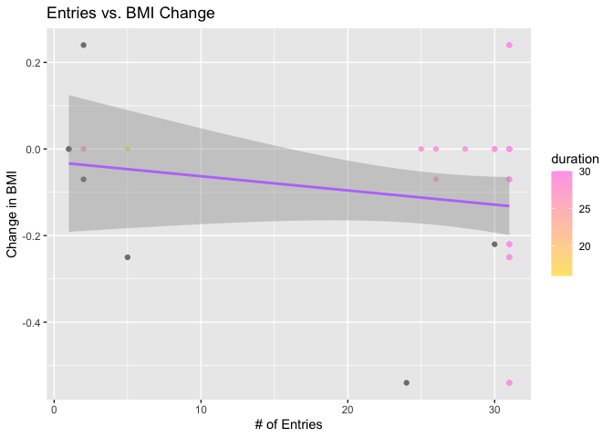<!-- -->

Wow, though it is small, there does seem to be a correlation between the
change in BMI and \# of entries! It looks like users engaging in more
entries lost more BMI.

How did users engage with the *weight* health aspect?

``` r
ggplot(data = body_changes, mapping = aes(x=entries,y=Weight_change, color=duration)) +
  geom_point() +
  geom_smooth(method="lm",color="#BB7CFB") +
  labs(title="Entries vs. Weight Change",x="# of Entries",y="Change in Weight (Pds)")+
  scale_color_gradient(low="#FCE57B",high="#FDA8EB")
```

    ## `geom_smooth()` using formula = 'y ~ x'

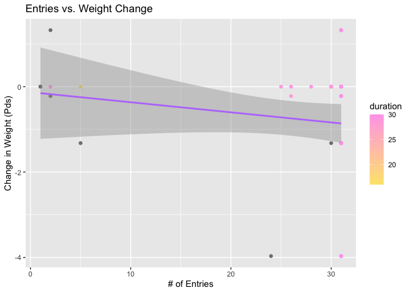<!-- -->

Wow!

Another correlation! Though there is a minor difference in BMI and
Weight lost, we also know that we only had 30 participants averaging
26.26 days and 25 entries per day. This minor correlation in weight loss
is a major breakthrough. This data suggests that heightened health
awareness could lead to substantial improvements. \# insert stats about
how long it takes to lose weight on average

This insight could position Bellabeat to enhance user health engagement
through strategies like contests and notifications.

Let’s see if we continue to see similar results with *calories* and \#
of entries per user Id.

``` r
# Entries vs Calories 
# Create a dataframe to get the total calories burned per user Id
total_calories_per_id <- dailyActivity_df %>%
  group_by(Id) %>%
  summarise(TotalCalories = sum(Calories, na.rm = TRUE))

#remove duplicates
usage_calories <- left_join(user_summary %>% select(-Data), total_calories_per_id, by = "Id")
usage_calories <- usage_calories %>% distinct(Id, .keep_all = TRUE)


ggplot(data = usage_calories, aes(x = TotalCalories, y = entries, color = duration)) + 
  geom_point() + 
  geom_smooth(method = 'lm', formula = y ~ poly(x, 2), se = FALSE, color = "#BB7CFB") + 
  labs(title = "Entries vs. Calories") +
  scale_color_gradient(low="#FCE57B",high="#FDA8EB")
```

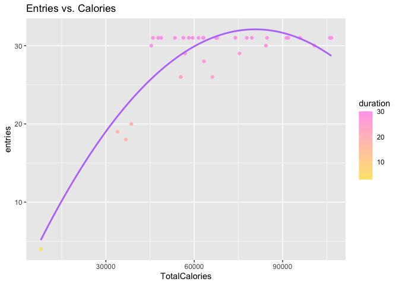<!-- -->

Incredible! We have yet another correlation towards the number of
entries per user and a health aspect. The visualization above shows a
clear indication that the more engaged a user was with their health
aspects, the more calories they burned!

*Note: During the analysis, correlations between weight/BMI, and heart
rate data were explored. However, there was very low sample size of
users contributing to both heart rate and weight/BMI data, which limited
the ability to establish significant correlations between the two.*

Now, let’s turn our focus to the **sleep** data, leveraging the merged
data sets for deeper exploration!

``` r
ggplot(data = activity_sleep, mapping = aes(x=TotalMinutesAsleep,y=SedentaryMinutes, color=TrackerDistance)) +
  geom_point() +
  geom_smooth(method="lm",color="#5a5c69") +
  labs(title="Total Minutes Asleep vs. Sedentary Minutes",x="Total Minutes Asleep",y="Sedentary Minutes")+
  scale_color_gradient(low="#fa70f3",high="#422d9e")
```

    ## `geom_smooth()` using formula = 'y ~ x'

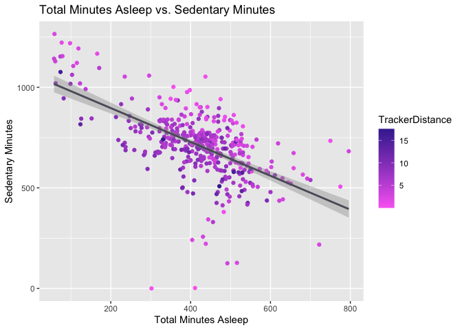<!-- -->

``` r
ggplot(data = activity_sleep, mapping = aes(x=TotalMinutesAsleep,y=VeryActiveMinutes, color=TrackerDistance)) +
  geom_point() +
  geom_smooth(method="lm",color="#5a5c69") +
  labs(title="Total Minutes Asleep vs. Very Active Minutes",x="Total Minutes Asleep",y="VeryActiveMinutes")+
  scale_color_gradient(low="#fa70f3",high="#422d9e")
```

    ## `geom_smooth()` using formula = 'y ~ x'

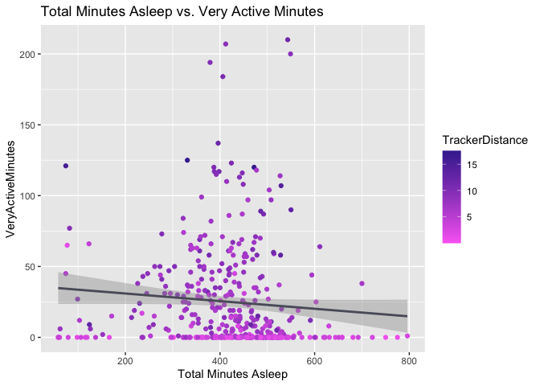<!-- -->

``` r
ggplot(data = activity_sleep, mapping = aes(x=TotalMinutesAsleep,y=TotalDistance, color=Calories)) +
  geom_point() +
  geom_smooth(method="lm",color="#5a5c69") +
  labs(title="Total Minutes Asleep vs. Total Distance",x="Total Minutes Asleep",y="Total Distance")+
  scale_color_gradient(low="#fa70f3",high="#422d9e")
```

    ## `geom_smooth()` using formula = 'y ~ x'

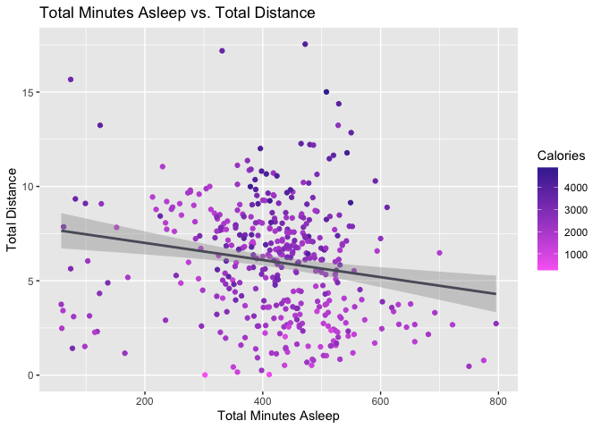<!-- -->

1.  Our first sleep graph suggests a potential negative correlation
    between sedentary behavior and total sleep duration.This pattern may
    imply that individuals who sleep more tend to be less sedentary, and
    vice versa.

2.  Our second sleep graph suggests a potential negative correlation
    between very active minutes and total sleep time which could imply
    that being TOO active could cause less sleep.

3.  Our third sleep graph suggests a potential negative correlation
    between the distance a user broached and their total sleep time.
    This could also imply that being too active could cause less sleep.

These are interesting findings and it is important to note that
correlation does not imply causation, and additional analysis would be
needed to draw more definitive conclusions. For instance: perhaps people
are not prioritizing their sleep in order to socialize, or perhaps
people work difficult working hours.

Let’s see if we see the same results when we look at activity levels in
a different way. Lets move on to **calories**!

``` r
custom_colors <- c("#FEE6EB", "#FDA8EB", "#BB7CFB", "#6CE2B6", "#FCE57B","#FE846C")

# Calories versus Steps
ggplot(data = dailyActivity_df, aes(x = TotalSteps, y = Calories)) + 
  geom_point(color = custom_colors[2]) + 
  geom_smooth(color = custom_colors[3]) +  # You can adjust the color of the smooth line
  labs(title = "Calories and Steps") +
  scale_color_manual(values = custom_colors)
```

    ## `geom_smooth()` using method = 'loess' and formula = 'y ~ x'

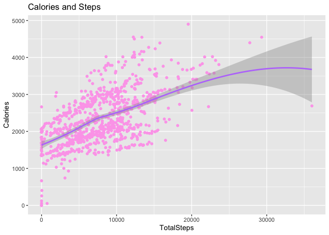<!-- -->

``` r
# Calories and Very Active Minutes
ggplot(data = dailyActivity_df, aes(x = VeryActiveMinutes, y = Calories)) + 
  geom_point(color = custom_colors[4]) + 
  geom_smooth(color = custom_colors[3]) + 
  labs(title = "Calories and Very Active Minutes")
```

    ## `geom_smooth()` using method = 'loess' and formula = 'y ~ x'

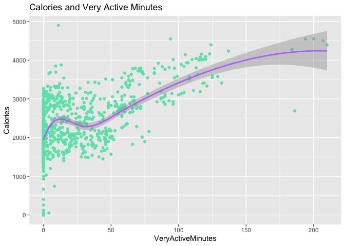<!-- -->

``` r
#Calories and Total Distance 
usage_calories <- usage_calories %>%
  left_join(dailyActivity_df %>% 
              group_by(Id) %>%
              summarise(total_distance = sum(TotalDistance)),
            by = "Id")

ggplot(data = usage_calories, aes(x = TotalCalories, y = total_distance)) +
  geom_point(color = custom_colors[6]) +
  geom_smooth(color = custom_colors[3]) +
  labs(title = "Calories and Distance")
```

    ## `geom_smooth()` using method = 'loess' and formula = 'y ~ x'

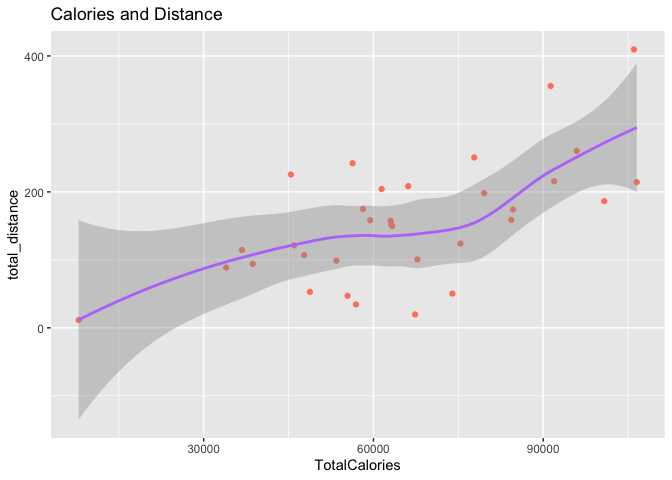<!-- -->

``` r
# Percent Spent in Different Active States

    VeryActive <- mean(dailyActivity_df$VeryActiveMinutes)
    FairlyActive <- mean(dailyActivity_df$FairlyActiveMinutes)
    LightlyActive <- mean(dailyActivity_df$LightlyActiveMinutes)
    Sedentary <- mean(dailyActivity_df$SedentaryMinutes)
  
    activityLevels <- c(VeryActive, FairlyActive, LightlyActive, Sedentary)

# Create a pie chart
pie(activityLevels, labels = c("VeryActiveMinutes","FairlyActiveMinutes","LightlyActiveMinutes","Sedentary"), 
    main = "Activity Levels", col = rainbow(length(activityLevels)), cex = 0.7)
```

<!-- -->

As you can see, there is a great correlation between calories and the
different health activity you might engage in, signifying there is
really nothing to lose if you are moving you body!

Sadly though, it does look like many of the users spent the largest
amount of their time in fairly inactive states.

Before we recap our final conclusions, let’s take a look at our *user
engagement per day*! This will help inform us to make the best
recommendations possible.

``` r
#First, we need to add a column to our dailyActivity_df that tells us what day of the week it is. 
dailyActivity_df <- dailyActivity_df %>%
  mutate(weekday = weekdays(as.Date(Date,"%m/%d/%Y")))
glimpse(dailyActivity_df)
```

    ## Rows: 940
    ## Columns: 16
    ## $ Id                       <dbl> 1503960366, 1503960366, 1503960366,…
    ## $ Date                     <date> 2016-04-12, 2016-04-13, 2016-04-14…
    ## $ TotalSteps               <dbl> 13162, 10735, 10460, 9762, 12669, 9…
    ## $ TotalDistance            <dbl> 8.50, 6.97, 6.74, 6.28, 8.16, 6.48,…
    ## $ TrackerDistance          <dbl> 8.50, 6.97, 6.74, 6.28, 8.16, 6.48,…
    ## $ LoggedActivitiesDistance <dbl> 0, 0, 0, 0, 0, 0, 0, 0, 0, 0, 0, 0,…
    ## $ VeryActiveDistance       <dbl> 1.88, 1.57, 2.44, 2.14, 2.71, 3.19,…
    ## $ ModeratelyActiveDistance <dbl> 0.55, 0.69, 0.40, 1.26, 0.41, 0.78,…
    ## $ LightActiveDistance      <dbl> 6.06, 4.71, 3.91, 2.83, 5.04, 2.51,…
    ## $ SedentaryActiveDistance  <dbl> 0, 0, 0, 0, 0, 0, 0, 0, 0, 0, 0, 0,…
    ## $ VeryActiveMinutes        <dbl> 25, 21, 30, 29, 36, 38, 42, 50, 28,…
    ## $ FairlyActiveMinutes      <dbl> 13, 19, 11, 34, 10, 20, 16, 31, 12,…
    ## $ LightlyActiveMinutes     <dbl> 328, 217, 181, 209, 221, 164, 233, …
    ## $ SedentaryMinutes         <dbl> 728, 776, 1218, 726, 773, 539, 1149…
    ## $ Calories                 <dbl> 1985, 1797, 1776, 1745, 1863, 1728,…
    ## $ weekday                  <chr> "Tuesday", "Wednesday", "Thursday",…

``` r
# create an order
dailyActivity_df$weekday <- ordered(dailyActivity_df$weekday, levels=c("Monday","Tuesday","Wednesday","Thursday","Friday","Saturday","Sunday"))
# create a new data frame to gain the counts per day
weekdayCounts <- dailyActivity_df %>% 
  group_by(weekday) %>% 
  summarize(count_of = n())
#create your graph to visualize the findings
ggplot(weekdayCounts, aes(x=weekday, y=count_of))+
  geom_bar(stat="identity",color="gray",fill="#BB7CFB") +
  labs(title="User Count Across Weekday", x="Day of the Week", y="Count") +
  geom_label(aes(label=count_of),color="black")
```

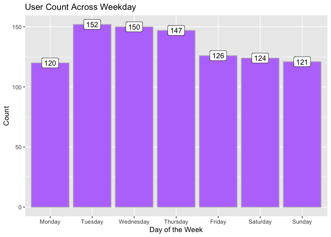<!-- -->

It is not shocking to see that users tend to struggle engaging with
their health aspects on the weekend and Mondays. Perhaps there is
something Bellabeat could do to increase weekend/Monday engagement and
increase their user’s wellness overall! Let’s talk conclusions!

------------------------------------------------------------------------

# *Recommendations*

**1. CDC Step Widget:** Bellabeat should motivate users to aim for at
least 8,000 steps per day, emphasizing the associated health benefits
and the CDC’s findings on mortality risk reduction. This could be done
by creating an app widget that showed a pie graph of how many steps a
user has taken out of the 8,000 each day.

**2. Weight Loss Support:** Provide users with low-calorie lunch and
dinner ideas, offering dietary suggestions to aid those seeking weight
loss. Incorporate a feature for users to log their daily meals, enabling
them to track their eating habits and manage caloric intake for
weight-related goals. This could increase engagement in the Weight
health aspect category.

**3. Sleep Improvement Notifications:** Utilize app notifications to
remind users to go to bed at optimal times, supporting better sleep
hygiene and overall well-being. Increase the tracking offered for the
sleep health aspect by tracking the number of times a user woke up, the
number of times a user snored, and the percentage in REM, deep sleep and
light sleep.

**4. Promote Physical Activity Friday-Monday:** Leverage the data
indicating increased activity between 5 pm and 7 pm to send motivational
notifications encouraging users to engage in physical activities like
running or walking during these hours. Partner with brands to create
giveaways for users with the most steps between certain hour.

**5. Reduce Sedentary Time for Better Sleep:** Recommend strategies to
reduce sedentary time for users looking to improve their sleep quality,
highlighting the correlation between reduced sedentary behavior and
better sleep.

**6. Expand Exercise Programs:** Conduct research gathering insights
about Bellabeat users’ preferred exercise routines, and introduce more
diverse exercising programs within the app to cater to different user
preferences and fitness levels.

**7. Post-Work Motivational Quotes:** Send motivational quotes or
messages during the peak activity hours after office hours to inspire
users to engage in physical activities like going to the gym or taking a
walk.

**8. Overall Health Summaries and Reports:** Create Weekly/Monthly
health recaps that highlight user engagement and different health
milestones!

------------------------------------------------------------------------

***A word from the author:** Thank you so much for viewing and engaging
in this analysis project with me. This is my very first R project and I
truly learned so much. Please feel free to leave any comments or
suggestions for improvement. I would love to have you as a part of my
data analysis network and journey!*
